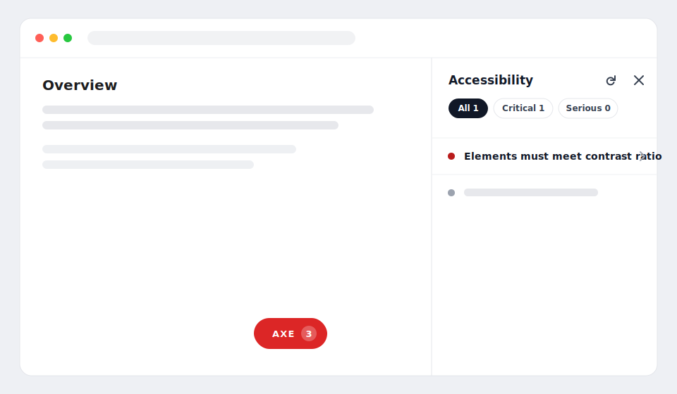

# axe-hud

[](https://github.com/mteimoori/axe-hud/actions/workflows/ci.yml)
[](./LICENSE)

> In-page accessibility HUD powered by [axe-core](https://github.com/dequelabs/axe-core). It audits
> the page you're looking at and surfaces findings in-context — a floating widget and a report
> sidebar — re-auditing automatically as you navigate.

**🔎 [Live demo →](https://mteimoori.github.io/axe-hud/)** · **📚 [API reference →](https://mteimoori.github.io/axe-hud/api/)**



Framework-agnostic core with an optional React binding. The library has **no environment logic** —
you decide where it runs by deciding where you load it (so it ships nothing to production).

> **Status:** early development (pre-1.0). The public API may change before `1.0.0`.

## Why

Accessibility regressions are easiest to catch while you're actually using the app. `axe-hud` gives
developers and QA live, in-context feedback against the **EU-required baseline**
(EN 301 549 ≈ WCAG 2.1 A + AA) without leaving the page or opening devtools.

## Features

- 🧭 Runs axe-core against the currently rendered page.
- 🔴🟢 Floating **widget** with a live violation count — neutral while auditing, red on violations, green when clean.
- 📋 Report **sidebar** grouped by impact, with severity filters, doc links, and click-to-highlight.
- 🔁 Re-audits on SPA navigation (History API, `popstate`, `hashchange`) and on demand.
- 🧱 Isolated in a **Shadow DOM** — never leaks styles into, or scans, your app's own UI.
- 🎛️ **No env gating in the library** — load it where you want it; guard the import and it never ships to production.
- ⚡ axe-core is **lazy-loaded** on first audit, and code-split so a guarded import drops it from prod bundles.
- ♿ The HUD itself is keyboard accessible (focus management, Escape to close, reduced-motion aware).

## Install

```sh
npm install axe-hud
# or: pnpm add axe-hud / yarn add axe-hud
```

## Quick start

`createAxeHud()` mounts the HUD immediately. The library has no environment gating, so **you**
decide where it runs by deciding where you load it.

### Vanilla

```ts
import { createAxeHud } from 'axe-hud'

const hud = createAxeHud()

// Imperative control if you need it:
hud.audit() // re-run on demand
hud.open() // open the report sidebar
hud.destroy() // tear everything down
```

### React

```tsx
import { AxeHudProvider } from 'axe-hud/react'

export function App() {
  return (
    <AxeHudProvider>
      <YourApp />
    </AxeHudProvider>
  )
}
```

Access the controller anywhere below the provider with `useAxeHud()`.

## Loading it for the right environments

Keep axe-hud out of production by **not importing it there**. A guarded dynamic import is the
reliable way — the bundler drops the whole chunk (axe-hud + axe-core) from builds where the branch
is statically false, so nothing ships to production.

```ts
// Load only in local + staging. `import()` keeps it out of the prod bundle entirely.
const APP_ENV = import.meta.env.VITE_APP_ENV // your own build-time variable

if (APP_ENV === 'development' || APP_ENV === 'staging') {
  const { createAxeHud } = await import('axe-hud')
  createAxeHud()
}
```

```ts
// Vite's built-in dev flag (local dev server only):
if (import.meta.env.DEV) {
  const { createAxeHud } = await import('axe-hud')
  createAxeHud()
}
```

```ts
// Node-style env (webpack, etc.):
if (['development', 'staging'].includes(process.env.APP_ENV)) {
  import('axe-hud').then(({ createAxeHud }) => createAxeHud())
}
```

For React, gate the provider (or its import) the same way. See
[docs/environments.md](./docs/environments.md) for more patterns.

## Configuration

| Option       | Type                                                           | Default                                                | Description                                        |
| ------------ | -------------------------------------------------------------- | ------------------------------------------------------ | -------------------------------------------------- |
| `axe`        | `AxeLike`                                                      | lazy `import('axe-core')`                              | Inject a custom/pinned axe instance.               |
| `axeOptions` | `axe.RunOptions`                                               | `{ runOnly: { type: 'tag', values: ['EN-301-549'] } }` | Options passed to `axe.run` (rule set).            |
| `axeContext` | `axe.ElementContext`                                           | excludes the HUD's own root                            | Context passed to `axe.run`.                       |
| `runOn`      | `{ initial?: boolean; navigation?: boolean }`                  | `{ initial: true, navigation: true }`                  | Which events trigger an audit.                     |
| `debounceMs` | `number`                                                       | `250`                                                  | Debounce window for navigation-triggered audits.   |
| `position`   | `'bottom-right' \| 'bottom-left' \| 'top-right' \| 'top-left'` | `'bottom-right'`                                       | Corner the widget is anchored to.                  |
| `onAudit`    | `(outcome) => void`                                            | _(none)_                                               | Callback fired with every completed audit outcome. |

### Controller

`createAxeHud()` returns a controller:

| Method      | Description                                    |
| ----------- | ---------------------------------------------- |
| `audit()`   | Run an audit of the current page now.          |
| `open()`    | Open the report sidebar.                       |
| `close()`   | Close the report sidebar.                      |
| `destroy()` | Remove the HUD and restore all global patches. |

## Rule set

The default targets the EU legal baseline via axe-core's `EN-301-549` tag (which incorporates
WCAG 2.1 A + AA). Widen or narrow it through `axeOptions`:

```ts
// Add best-practice rules and WCAG 2.2 AA on top of the EU baseline:
createAxeHud({
  axeOptions: { runOnly: { type: 'tag', values: ['EN-301-549', 'best-practice', 'wcag22aa'] } },
})
```

## Performance

axe-core is imported lazily on the first audit and runs debounced and deferred to browser idle time.
Navigation re-audits are coalesced, and superseded runs are discarded. When you load axe-hud behind
a guarded dynamic import, it and axe-core are code-split out of production builds entirely, so end
users never download either.

## Browser support

Modern evergreen browsers (Chromium, Firefox, Safari). axe-hud is a development/QA aid and is not
intended to ship to end users in production.

## Documentation

- [Loading it for the right environments](./docs/environments.md)
- [Recipes](./docs/recipes.md)
- [Architecture](./docs/architecture.md) (for contributors)
- [API reference](https://mteimoori.github.io/axe-hud/api/)

## Contributing

See [CONTRIBUTING.md](./CONTRIBUTING.md). Issues and PRs welcome.

## License

[MIT](./LICENSE)
